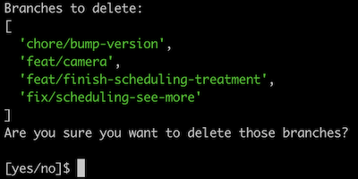
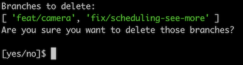

# Clear Branches
Productivy and easy way to clear your local branches *(This library is not finished yet, it isn't working well)*

## WIP
- [x] Setup to run using `clear-branches` or `npx clear-branches`
- [ ] Setup to run cross environment (unix or windows) platforms, [shelljs](https://github.com/shelljs/shelljs) could be a good solution
- [ ] Code improvement, it's a messy today, sorry.
- [ ] Security improvement using Deno.

## Getting started


#### Peer dependency
- Node equal or greater than `v14`

#### Install and Run
If you don't want to install globaly, you can just execute into your git project:

```shell
$ npx clear-branches
```

Or installing: 

**yarn:** 
```shell 
$ yarn global add clear-branches
$ cd your-git-project/
$ clear-branches
```

**npm:**
```shell 
$ npm i -g clear-branches
$ cd your-project/
$ clear-branches
```

#### Usage

Inside your project:

```shell
$ cd your-git-project/
$ clear-branches
```



You will see all branches that will be deleted to confirm if everything is alright.
It automatically ignores **master**, **develop** and **release** branches.

#### Options

But, if you want to ignore more banches: 

```shell
clear-branches --ignore=chore/bump-version,feat/finish-scheduling-treatment
```



